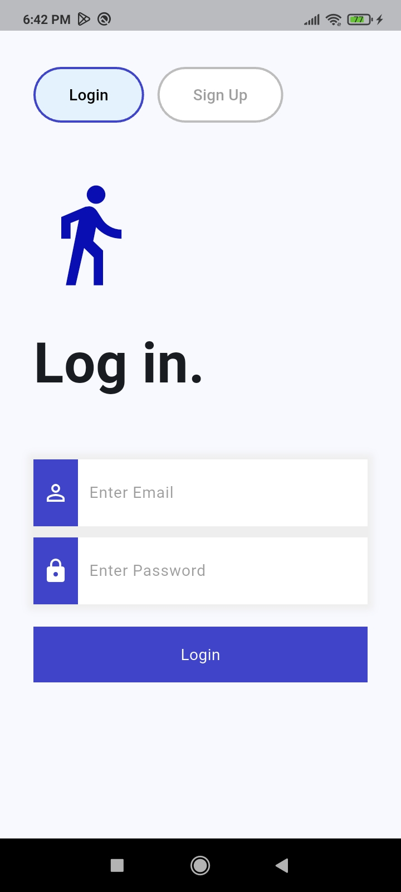
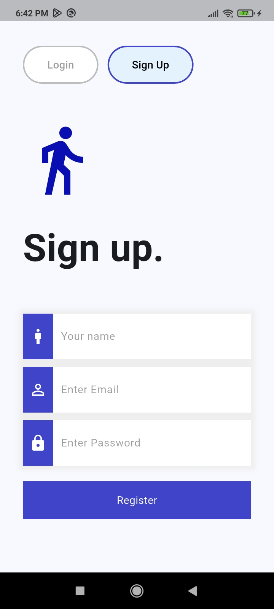
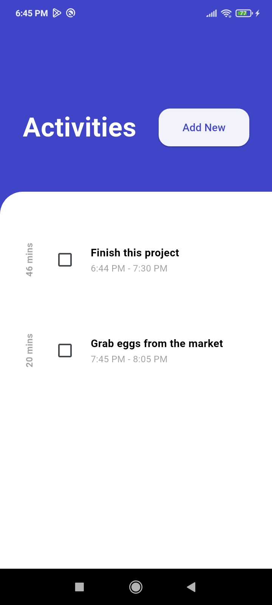
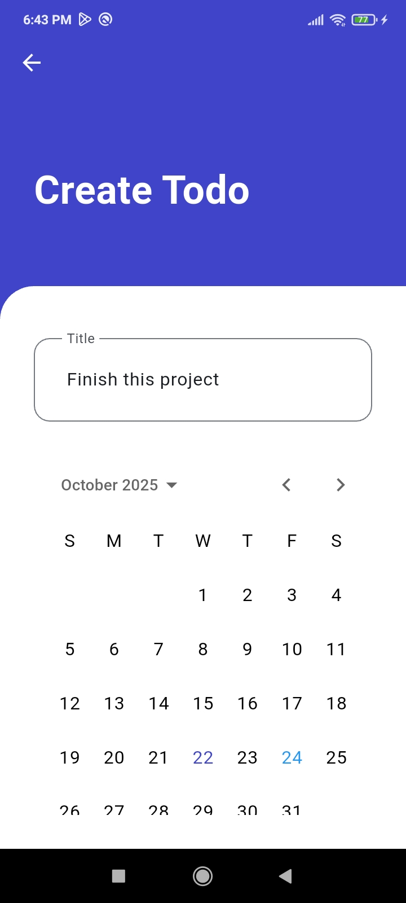
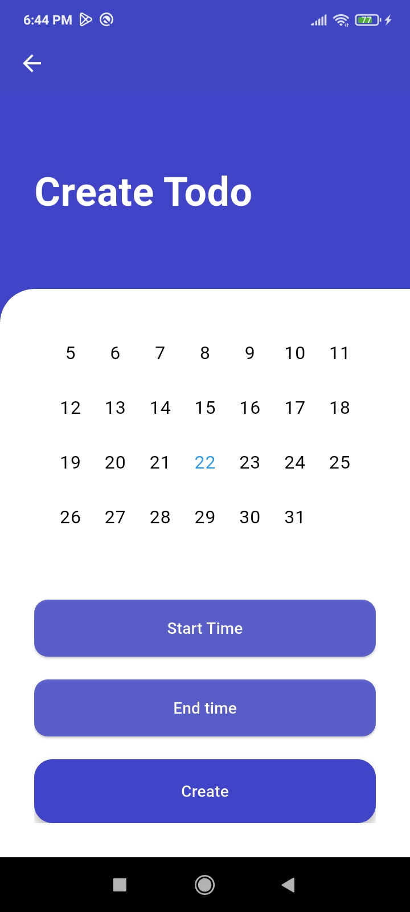

# flutter_todo_app

A new Flutter project.

## Getting Started

This project is a starting point for a Flutter application.

A few resources to get you started if this is your first Flutter project:

- [Lab: Write your first Flutter app](https://docs.flutter.dev/get-started/codelab)
- [Cookbook: Useful Flutter samples](https://docs.flutter.dev/cookbook)

For help getting started with Flutter development, view the
[online documentation](https://docs.flutter.dev/), which offers tutorials,
samples, guidance on mobile development, and a full API reference.

## How to use this project:

1. Clone the backend repo for this project:
```
git clone https://github.com/NickName-AM/flutter_todo_app_backend.git
```

2. Follow the README.md [here](https://github.com/NickName-AM/flutter_todo_app_backend.git) to run the backend.

3. Clone this repo
```
git clone https://github.com/NickName-AM/flutter_todo_app.git
```

4. Navigate to `lib/core/endpoint.dart` and change the address to your address:
```
For example:
Change:
static final String endpoint = "http://192.168.1.68:8000/api";

to:
static final String endpoint = "http://your.ip.add.ress:8000/api";
```

5. Install dependencies
```
cd flutter_todo_app
flutter pub get
```

6. Connect your device or emulator

7. Run the app
```
flutter run
```


## Demo Images
<p align="center">





</p>